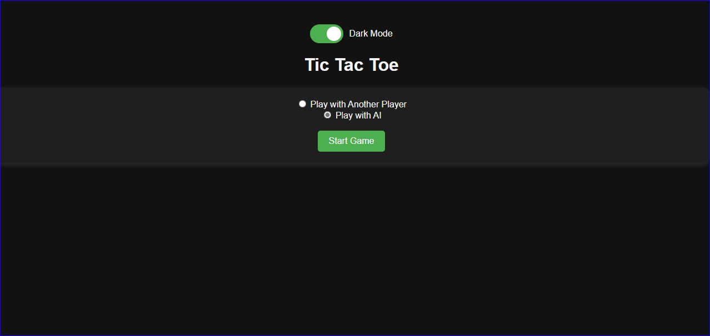
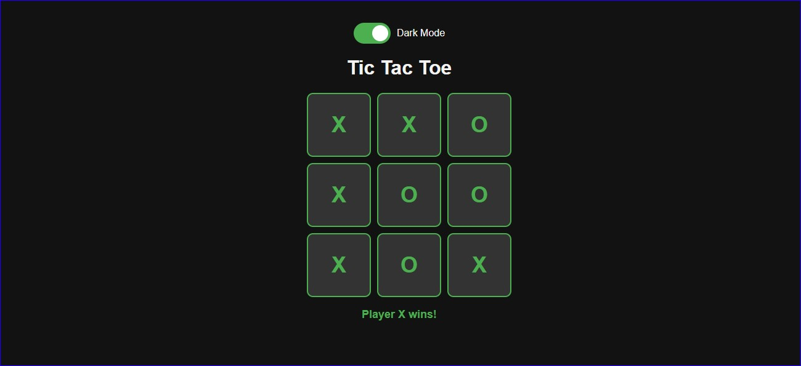
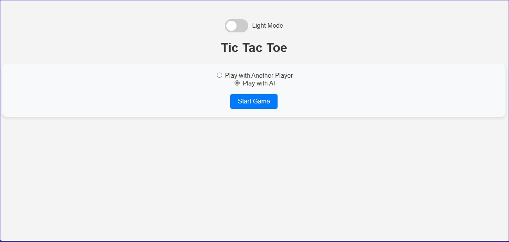
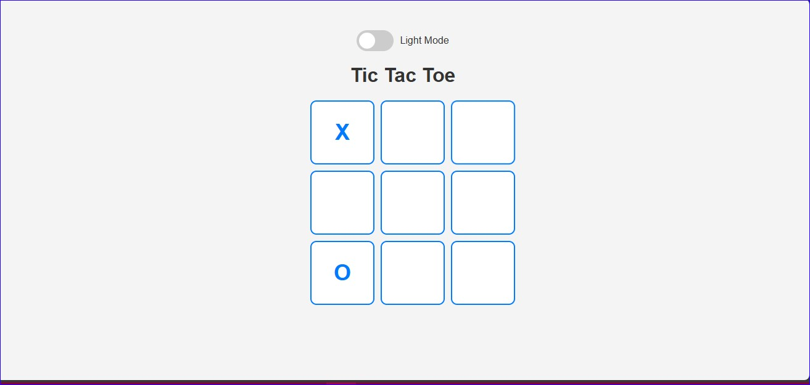

# Tic Tac Toe Game

## Description
- This project is a simple implementation of the classic Tic Tac Toe game using HTML, CSS3, and JavaScript.
- It features two playing modes (Player vs Player and Player vs AI) and supports two visual themes (Light Mode and Dark Mode).

## Deployment

Experience the game yourself at [TicTacToe](https://schat55.github.io/TicTacToe/) and provide a feedback /suggestion.


## Screenshots








## Features

#### Two Playing Modes:
- Player vs Player: Two players can play against each other on the same device.
- Player vs AI: A single player can play against an AI opponent.
#### Visual Themes:

- Light Mode: A clean and bright interface.
- Dark Mode: A darker interface for reduced eye strain in low-light environments.
- Responsive Design: The game is designed to work well on both desktop and mobile devices.

## Tech Stack

**HTML5:** Structuring the game layout.

**CSS3:** Styling the game interface and themes.

**JavaScript:** Implementing game logic and interactions using a simple random function to generate AI moves.


## Usage

#### Getting Started
To run the game locally, follow these steps:

- Clone the repository: ```git clone https://github.com/your-username/tic-tac-toe.git```
- Navigate to the project directory.
- Open index.html in your web browser.

## Contributing

#### Contributions are welcome!

If you find any issues or have suggestions for improvements, please open an issue or create a pull request on GitHub.

